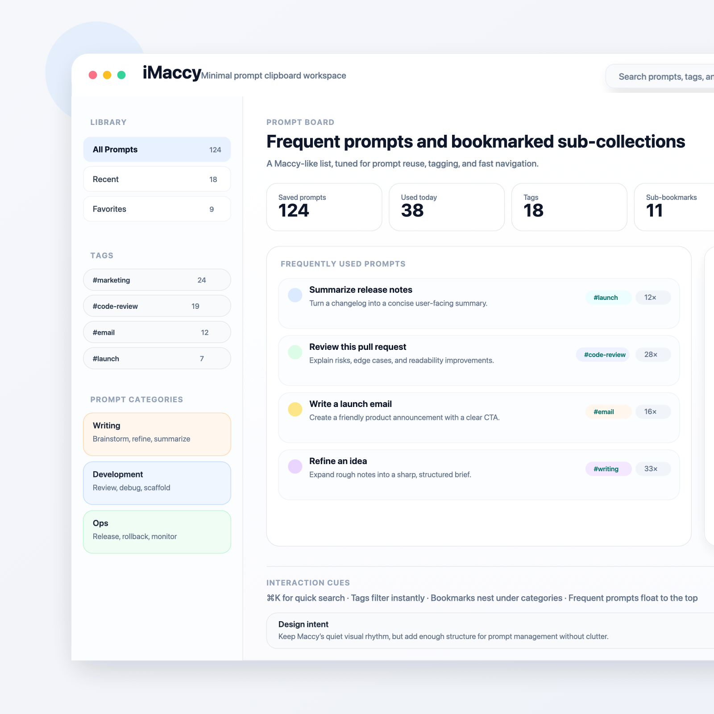

# iMaccy

> 一个基于 Maccy 演进的 macOS 剪贴板工作台，重点强化 Prompt 的沉淀、组织与复用。

`iMaccy` 已经是一个**可构建、可测试、可发布**的 macOS 应用，而不只是设计稿仓库。它在保留 [p0deje/Maccy](https://github.com/p0deje/Maccy) 轻量、原生、键盘优先体验的基础上，增加了 Prompt Library、标签、子书签、批量操作和发布链路收口。

## 当前状态

- 已完成 iMaccy 品牌收口（工程、Bundle ID、更新源）
- 已实现 Prompt Library、标签、子书签、常用 Prompt、最近子书签、批量操作与 `#标签` 搜索
- 已具备 GitHub Releases + Sparkle `appcast.xml` 的发布基础
- 当前仓库继续基于上游 Maccy 演进

## 核心功能

- **Prompt Library**：把历史剪贴板内容沉淀为可复用 Prompt
- **标签 / 子书签**：支持按标签和 Prompt 子书签管理内容
- **常用 Prompt**：把高频 Prompt 单独收敛出来
- **高效整理**：支持最近子书签、批量归类、批量加/移标签、批量收藏
- **快速检索**：支持文本搜索和 `#标签` 搜索
- **Prompt Settings**：支持默认视图、最近子书签数量、摘要显示等配置

## 本地开发

### 打开工程

```bash
open iMaccy.xcodeproj
```

### 构建

```bash
xcodebuild -project iMaccy.xcodeproj -scheme iMaccy -configuration Debug build
```

### 测试

```bash
xcodebuild test -project iMaccy.xcodeproj -scheme iMaccy -destination 'platform=macOS'
```

## 发布说明

- **Release**：用于本地验证、非正式产物构建
- **Distribution**：用于正式分发，面向 `Developer ID Application + notarization`
- 详细发布步骤见：[`docs/release.md`](./docs/release.md)

## 设计文档

- [`docs/spec/imaccy-design-spec.md`](./docs/spec/imaccy-design-spec.md)：完整产品与技术设计方案
- [`docs/spec/imaccy-implementation-plan.md`](./docs/spec/imaccy-implementation-plan.md)：分阶段改造计划与任务拆分
- [`docs/ui/imaccy-wireframe.svg`](./docs/ui/imaccy-wireframe.svg)：UI 设计图（SVG）
- [`docs/ui/imaccy-wireframe.png`](./docs/ui/imaccy-wireframe.png)：UI 设计图预览（PNG）
- [`docs/ui/notes.md`](./docs/ui/notes.md)：UI 草图说明

## UI 设计图预览



## 仓库来源

- Upstream: [p0deje/Maccy](https://github.com/p0deje/Maccy)
- Current repo: [izscc/iMaccy](https://github.com/izscc/iMaccy)

实现策略上，iMaccy 尽量不破坏 Maccy 原始历史主链路，而是在其上增加独立的 Prompt Library 能力。
