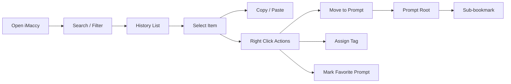
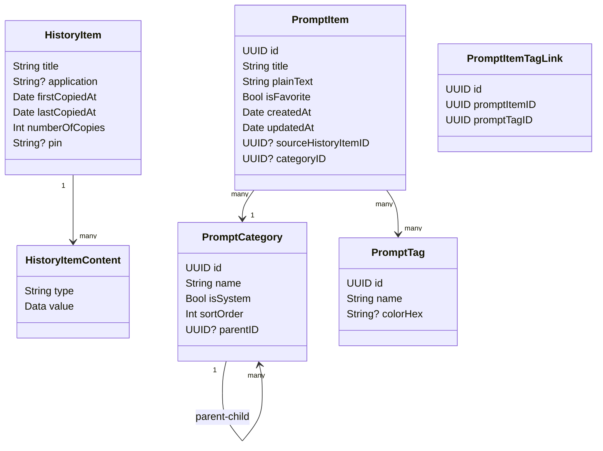

# Spec: iMaccy

## Assumptions

以下假设基于你当前的需求，我先按此收敛方案：

1. `iMaccy` 以 **Maccy 2.x 当前架构继续演进**，不是从零重写。
2. 第一阶段目标平台是 **macOS 14+**，继续沿用原生 macOS 桌面交互。
3. 第一阶段不做云同步，只做 **本地单机** 数据管理。
4. “移动到 Prompt 分类” 在产品语义上表示 **从剪贴板历史中提取一份可复用副本，归档到 Prompt Library**，不会把它从原始历史里删除。
5. “子书签” 在数据结构上按 **Prompt 根分类下的子分类/子节点** 处理，UI 命名上可以继续叫“子书签”。
6. “常用 Prompt” 与 Maccy 现有“Pin/固定”不是同一个概念：
   - `Pin`：影响列表排序与快捷访问
   - `Favorite Prompt`：影响 Prompt 体系中的收藏与常用筛选

---

## Objective

把 Maccy 从“剪贴板历史工具”升级成“**Prompt 导向的剪贴板工作台**”。

核心目标：

- 仍然具备 Maccy 的快速检索与历史复制能力
- 针对 Prompt 场景提供更强的归类、收藏、复用能力
- 保持 UI 简洁、原生、轻量、优雅，不走重型知识库产品路线

### 目标用户

- 高频使用 AI / LLM 的开发者
- 需要管理大量 Prompt 模板的内容/运营/设计人员
- 习惯用 Maccy 作为日常剪贴板入口，但希望把“好 Prompt”沉淀下来的人

### 成功标准

1. 用户可以在 1 次右键操作内把任意剪贴板内容归档到 `Prompt`。
2. 用户可以在 `Prompt` 下继续按“子书签”细分，例如：写作、编程、翻译、运营。
3. 用户可以把某条 Prompt 标记为“常用 Prompt”。
4. 在不进入设置页的前提下，用户就能完成：
   - 搜索 Prompt
   - 给条目打标签
   - 移动到 Prompt 分类
   - 选择 Prompt 子书签
   - 收藏为常用 Prompt
5. 默认弹窗仍保留 Maccy 的“打开即搜、上下选择、回车使用”的核心节奏。

---

## Reference Baseline: Current Maccy

基于对 Maccy 仓库的现状分析，现有基础非常适合作为 iMaccy 的宿主：

### 现有能力（可直接复用）

- `FloatingPanel + SwiftUI` 的主弹窗结构
- `HistoryItem + SwiftData` 的本地持久化
- 键盘优先选择、搜索、复制/粘贴
- 右侧 slideout 预览能力
- 菜单栏入口与全局快捷键
- 设置页体系（General / Appearance / Pins / Ignore / Storage / Advanced）

### 关键参考点

- 应用入口：`Maccy/MaccyApp.swift`
- 面板与窗口行为：`Maccy/FloatingPanel.swift`
- 存储容器：`Maccy/Storage.swift`
- 剪贴板监听：`Maccy/Clipboard.swift`
- 核心数据：`Maccy/Models/HistoryItem.swift`
- 历史容器与筛选：`Maccy/Observables/History.swift`
- 主界面：`Maccy/Views/ContentView.swift`
- 列表：`Maccy/Views/HistoryListView.swift`
- 条目行：`Maccy/Views/HistoryItemView.swift`
- 设置页装配：`Maccy/Observables/AppState.swift`

---

## Product Scope

### In Scope

#### 1. 标签化管理（Tagging）

- 每条剪贴板记录可绑定 0..n 个标签
- 标签支持颜色/名称/排序
- 标签支持被搜索和过滤
- 标签可作为快速筛选入口

#### 2. 默认 Prompt 分类

- 首次启动自动生成一个系统内置分类：`Prompt`
- 用户可以把任意历史条目直接归档到 `Prompt`
- `Prompt` 是系统默认分类，不能删除，但可以隐藏或重命名显示名（可选）

#### 3. Prompt 子书签 / 子分类

- `Prompt` 根分类下允许创建多个子书签
- 推荐默认种子（可选启用）：
  - Writing
  - Development
  - Translation
  - Marketing
  - General
- 子书签可排序、重命名、删除
- 条目可归属于 `Prompt` 根分类和某一个子书签

#### 4. 常用 Prompt（Favorite Prompts）

- 任意已归档到 `Prompt` 的条目都可以标记为常用
- 常用 Prompt 有独立筛选视图
- 常用 Prompt 在 Prompt 列表中具备更高显示优先级

#### 5. 右键快捷归档

在历史条目的右键菜单中新增：

- `移动到 Prompt`
- `移动到 Prompt > 最近使用的子书签`
- `移动到 Prompt > 选择子书签…`
- `标记为常用 Prompt`
- `添加标签…`
- `从 Prompt 中移出`

#### 6. Prompt 优化检索

- 支持按关键字检索 Prompt
- 支持按标签过滤
- 支持按子书签过滤
- 支持只看常用 Prompt

### Out of Scope（第一阶段不做）

- iCloud / 多设备同步
- AI 自动打标签 / 自动识别 Prompt 类型
- 团队协作共享 Prompt
- 富文本 Prompt 编辑器
- 云端模板市场
- 与第三方 AI 工具的深度插件式集成

---

## Information Architecture

推荐把 iMaccy 设计成 **两层体验**：

### A. Quick Popup（默认主弹窗）

延续 Maccy 的核心体验：

- 搜索框
- 主列表
- 右侧详情预览（沿用现有 slideout）
- 顶部轻量筛选：`全部` / `Prompt` / `常用` / `已固定`
- 行内轻量标签 Chip
- 右键上下文操作

> 这是 80% 用户最常用的入口。

### B. Organize Mode（组织模式）

在不脱离主弹窗的情况下，给重度用户提供更强的组织能力：

- 左侧窄导航：
  - All
  - Prompt
  - Favorites
  - Tags
  - Prompt Categories
- 中间仍是列表
- 右侧为详情与分类操作

> 组织能力出现，但不抢走 Maccy 的极简感。

---

## UX Structure



---

## Core Interaction Design

### 1. 默认主视图

#### 顶部
- 应用标题 / Logo
- 搜索框
- 轻量筛选切换：
  - 全部
  - Prompt
  - 常用
  - 已固定

#### 中部主列表
每条记录展示：
- 应用图标 / 类型图标
- 标题（截断）
- 1~2 个标签 Chip
- 可选：常用 Prompt 星标 / Prompt 标识
- 原有快捷数字或快捷访问方式

#### 右侧详情（沿用现有 Preview Slideout）
展示：
- 完整内容预览
- 来源应用
- 首次/最近复制时间
- 复制次数
- 当前标签
- 所属 Prompt 子书签
- 快速操作按钮：
  - 加入 Prompt
  - 切换子书签
  - 收藏为常用
  - 固定 / 删除

### 2. Prompt 分类交互

#### 方式 A：右键快速移动
右键任意历史条目：

- `移动到 Prompt`
  - 若没有默认子书签，则进 Prompt 根目录
- `移动到 Prompt > 选择子书签…`
  - 弹出轻量子菜单
- `移动到 Prompt > 最近使用`
  - 提升操作效率

#### 方式 B：详情面板操作
选中条目后，右侧详情中显示：

- 当前是否属于 Prompt
- 当前属于哪个子书签
- 下拉切换子书签
- 星标按钮：常用 Prompt

### 3. 标签交互

- 右键 `添加标签…`
- 详情面板展示 Tag Chips
- 点击 Tag Chip 可立即过滤列表
- 搜索支持 `#tagName` 形式的增强过滤（第二阶段可加）

### 4. 常用 Prompt 交互

- 星标按钮切换收藏状态
- `常用` 作为一级筛选
- Prompt 分类下优先显示常用条目

---

## Visual Design Direction

### 设计关键词

- Quiet
- Native
- Precise
- Lightweight
- Glossy, but not flashy

### 视觉原则

1. 保留 Maccy 的圆角浮层、半透明材质、轻分隔。
2. 新增信息不做“管理后台感”设计，而是做 **低侵入组织信息**。
3. 标签和 Prompt 分类使用极浅色块与低饱和强调色。
4. 强交互动作（移动到 Prompt / 收藏）应在 hover、右键、详情区出现，不常驻堆满主列表。

### 推荐布局

- 左：组织结构（仅在需要时出现）
- 中：主列表（保持 Maccy 的主心智）
- 右：详情与动作区（复用现有 slideout 思路）

### UI 设计图

仓库内已提供：

- `docs/ui/imaccy-wireframe.svg`
- `docs/ui/imaccy-wireframe.png`

---

## Data Model Proposal

### Architecture Decision

这里有两条路：

#### 路线 A：直接把 `HistoryItem` 扩展成“带标签/分类”的总模型
优点：最终形态统一。
缺点：会直接牵动 `History.swift`、去重、排序、Pin、搜索、快捷键和 UI 渲染，改动面偏大。

#### 路线 B：保留 `History` 为原始剪贴板历史，新增独立 `Prompt Library` 域
优点：**最符合“继续改造 Maccy，而不是重写 Maccy”**，对现有主链路影响最小。
缺点：会多出一套 Prompt 领域对象。

### Final Recommendation

**第一阶段选路线 B。**

也就是：
- `HistoryItem` 继续代表原始剪贴板历史
- 新增 `PromptItem` 代表被沉淀下来的 Prompt 资产
- 右键“移动到 Prompt”本质是从 `HistoryItem` 生成/更新一条 `PromptItem`
- Prompt 的标签、子书签、收藏，都挂在 `PromptItem` 上

这样能最大化复用 Maccy 的稳定部分，同时把 Prompt 管理做成一个清晰边界的新增能力。



### 推荐实体定义

#### `HistoryItem`
不承担 Prompt 分类语义，继续只负责“剪贴板历史”。

#### `PromptItem`
代表已经被沉淀为 Prompt 资产的内容。

字段建议：
- `id`
- `title`
- `plainText`
- `renderedPreview`（可选）
- `isFavorite`
- `sourceHistoryItemID`
- `categoryID`
- `createdAt`
- `updatedAt`
- `usageCount`（可选）

#### `PromptCategory`
承载：
- 系统默认 `Prompt` 根分类
- `Prompt` 下的子书签 / 子分类

字段建议：
- `id`
- `name`
- `parentID`
- `isSystem`
- `sortOrder`
- `symbolName`

#### `PromptTag` + `PromptItemTagLink`
承载标签化管理，且只作用在 Prompt 域内。

> 这样做的好处是：
> - 历史记录继续保持轻量扁平
> - Prompt 变成“精选资产层”，更符合你的使用场景
> - 右键“移动到 Prompt”非常自然
> - 后续若想把标签扩展到所有历史项，也还有演进空间

---

## Search & Filtering Strategy

### 第一阶段

- `History.searchQuery` 继续服务于原始历史列表
- 新增 `PromptLibrary.searchQuery` 服务于 Prompt 资产列表
- Prompt 域叠加过滤条件：
  - 当前一级筛选（全部 / Prompt / 常用）
  - 当前标签筛选
  - 当前 Prompt 子书签筛选

### 第二阶段

支持增强搜索语法：

- `#marketing`
- `in:prompt`
- `bookmark:writing`
- `fav:true`

### 推荐实现方式

新增一个 Prompt 过滤描述对象：

```swift
struct PromptFilterState {
  var scope: Scope
  var selectedTagIDs: Set<PersistentIdentifier>
  var selectedCategoryID: PersistentIdentifier?
  var favoritesOnly: Bool
}
```

然后在 `PromptLibrary` 中：

- `allPrompts`: 所有 Prompt 资产
- `visiblePrompts`: 当前可见 Prompt
- `filterState`: 当前筛选条件

将查询升级为：

`searchQuery + filterState -> visiblePrompts`

---

## Architecture Proposal

### 继续保留的部分

- `FloatingPanel`：继续作为主弹窗容器
- `Clipboard`：继续负责监听系统剪贴板
- `History`：继续作为原始历史协调层
- `SwiftData`：继续做本地持久化
- `SlideoutController`：继续作为详情/操作面板宿主

### 新增模块

#### 1. `PromptLibrary`
职责：
- 维护 PromptItem 列表
- 负责 Prompt 搜索、收藏、排序、归档

#### 2. `PromptCategoryStore`
职责：
- 维护 Prompt 根分类与子书签树
- 提供默认种子与排序能力

#### 3. `PromptTagStore`
职责：
- 维护 Prompt 标签
- 提供标签增删改查

#### 4. `PromptOrganizer`
职责：
- 把 `HistoryItem` 转成 `PromptItem`
- 处理“移动到 Prompt / 切换子书签 / 收藏 Prompt / 打标签”

#### 5. `PromptFilterStateStore`
职责：
- 承载 Prompt 当前筛选状态
- 与 `PromptLibrary` 配合产出可见列表

#### 6. `ContextMenuBuilder`
职责：
- 生成 row-level 右键菜单操作项
- 保持操作语义集中，避免散落在多个 View 中

---

## UI Modules Proposal

### 新增 View

- `Views/PromptBrowserView.swift`
- `Views/PromptListView.swift`
- `Views/PromptRowView.swift`
- `Views/PromptSidebarView.swift`
- `Views/PromptTagChipView.swift`
- `Views/PromptBookmarkPickerView.swift`
- `Views/ItemContextMenuModifier.swift`
- `Views/PromptInspectorView.swift`
- `Views/FavoritePromptButton.swift`

### 新增 Observable / Store

- `Observables/PromptLibrary.swift`
- `Observables/PromptCategoryStore.swift`
- `Observables/PromptTagStore.swift`
- `Observables/PromptFilterStateStore.swift`
- `Observables/PromptOrganizer.swift`

### 新增 Model

- `Models/PromptItem.swift`
- `Models/PromptCategory.swift`
- `Models/PromptTag.swift`
- `Models/PromptItemTagLink.swift`

### 新增 Settings Pane

- `Settings/PromptSettingsPane.swift`
- `Settings/TagSettingsPane.swift`（可选）

> 如果想控制改动量，也可以第一版只新增一个：`Settings/LibrarySettingsPane.swift`

---

## Recommended Implementation Strategy

### Phase 1: Prompt 域数据层

- 扩展 `SwiftData` schema
- 新增 `PromptItem / PromptCategory / PromptTag`
- 注入默认 `Prompt` 根分类

### Phase 2: Prompt 视图与筛选状态

- 加入一级筛选（全部 / Prompt / 常用）
- 加入子书签过滤
- 加入标签过滤

### Phase 3: 交互

- row-level 右键菜单新增“移动到 Prompt / 添加标签 / 收藏 Prompt”
- 详情面板新增 Prompt 管理区

### Phase 4: 设置与组织能力

- Prompt/标签管理设置页
- 子书签创建、排序、重命名

### Phase 5: 打磨

- 搜索语法增强
- 最近使用子书签
- 批量归档与键盘快捷操作

---

## Commands

以下命令是**后续进入实现阶段**时建议采用的开发命令：

```bash
git clone https://github.com/izscc/iMaccy.git
cd iMaccy
open iMaccy.xcodeproj
```

如本机安装完整 Xcode，可使用：

```bash
xcodebuild -project iMaccy.xcodeproj -scheme iMaccy -configuration Debug build
xcodebuild test -project iMaccy.xcodeproj -scheme iMaccy -destination 'platform=macOS'
```

设计稿直接预览：

```bash
open /Users/zscc.in/Desktop/AI/imaccy/docs/ui/imaccy-wireframe.svg
open /Users/zscc.in/Desktop/AI/imaccy/docs/ui/imaccy-wireframe.png
```

---

## Project Structure (Target)

```text
App/
Views/
Models/
Observables/
Settings/
Services/
Support/
Tests/
docs/spec/
docs/ui/
```

### 设计仓库当前结构

```text
README.md
docs/spec/imaccy-design-spec.md
docs/spec/imaccy-implementation-plan.md
docs/ui/imaccy-wireframe.svg
docs/ui/imaccy-wireframe.png
docs/ui/notes.md
```

---

## Code Style

实现阶段建议继续遵循 Maccy 当前风格：

- SwiftUI 为主
- AppKit bridge 只用于必要窗口行为
- 小而清晰的 Observable / Store
- 保持 View 轻量，业务逻辑放 Store / Model 层

示例风格：

```swift
@Observable
final class LibraryStore {
  var nodes: [LibraryNode] = []

  func seedDefaultsIfNeeded() {
    guard !nodes.contains(where: { $0.kind == .promptRoot }) else { return }
    nodes.append(.promptRoot(name: "Prompt"))
  }
}
```

---

## Testing Strategy

### 单元测试

- `History` 过滤逻辑
- Prompt 归档逻辑
- 标签关系逻辑
- Favorite Prompt 排序逻辑
- 默认 Prompt 种子注入

### 集成测试

- 剪贴板新内容进入历史
- 右键加入 Prompt 后 UI 正确更新
- 子书签切换后筛选结果正确
- 常用 Prompt 视图只展示收藏项

### UI 测试

- 打开弹窗
- 搜索关键词
- 切换 Prompt 过滤
- 打开右键菜单
- 移动到 Prompt 子书签

---

## Boundaries

### Always do

- 尽量复用 Maccy 现有结构，而不是重写
- 优先保持键盘优先和极简视觉
- 新增能力放在渐进式界面，不破坏默认工作流

### Ask first

- 是否把 Prompt 设计为独立窗口模式
- 是否引入 iCloud / 同步
- 是否引入 AI 自动分类
- 是否改动全局快捷键体系

### Never do

- 不把 iMaccy 做成臃肿数据库式应用
- 不牺牲 Maccy 的打开速度和选择效率
- 不为了“功能全”破坏简洁与原生感

---

## Risks & Mitigations

### 风险 1：组织能力过多导致 UI 变重

**应对：** 默认仍是 Quick Popup，左侧组织面板按需出现。

### 风险 2：数据模型扩展影响性能

**应对：** 维持 `HistoryItem` 为主表，分类关系单独建模；避免在主列表渲染时做高成本 join。

### 风险 3：Prompt 收藏与 Pin 语义混淆

**应对：** 明确区分：
- Pin = 顶置/快捷
- Favorite Prompt = Prompt 收藏

### 风险 4：迁移老用户数据复杂

**应对：** 第一次迁移只做 schema 扩展，不修改已有历史内容；仅插入系统 Prompt 根分类。

---

## Final Recommendation

**最佳路线不是“重做一个 Maccy”**，而是：

> **用最小的结构改动，把 Maccy 升级为一个更适合 Prompt 资产管理的剪贴板工作台。**

最关键的三个落点：

1. 新增独立 `Prompt Library` 域，避免破坏 Maccy 的原始历史主链路
2. 交互层引入 row-level 右键归档 Prompt 与详情侧栏管理
3. 视觉层保持 Maccy 的轻、薄、静，不做后台式复杂 UI

